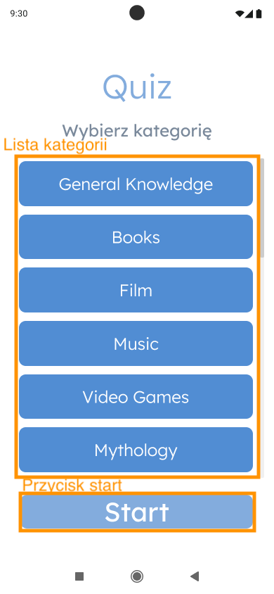
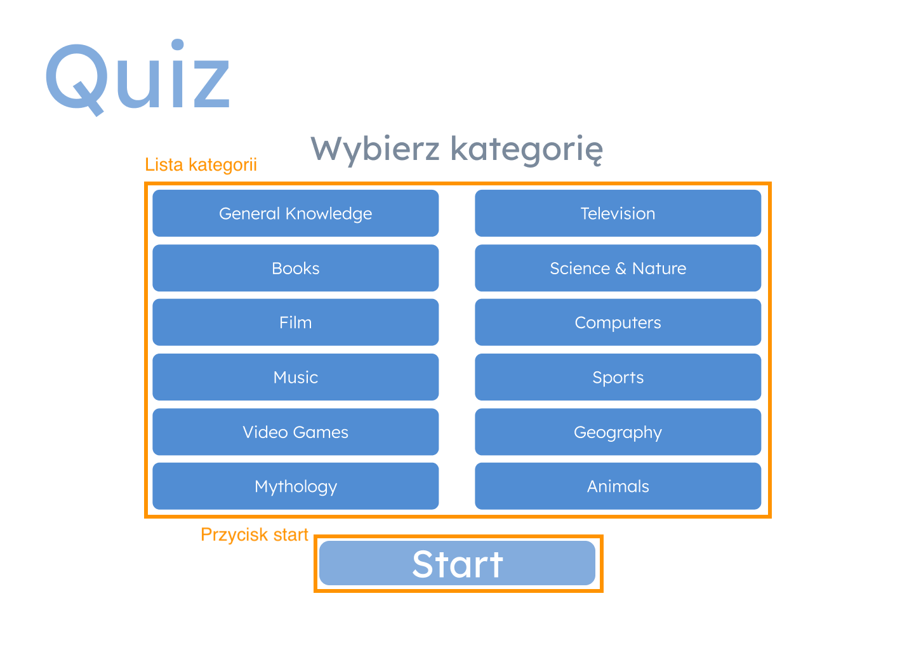
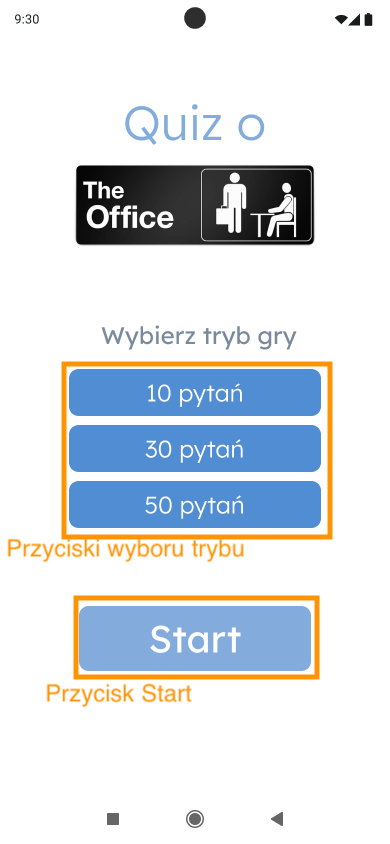
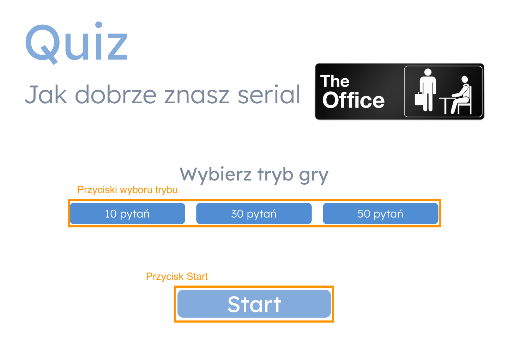
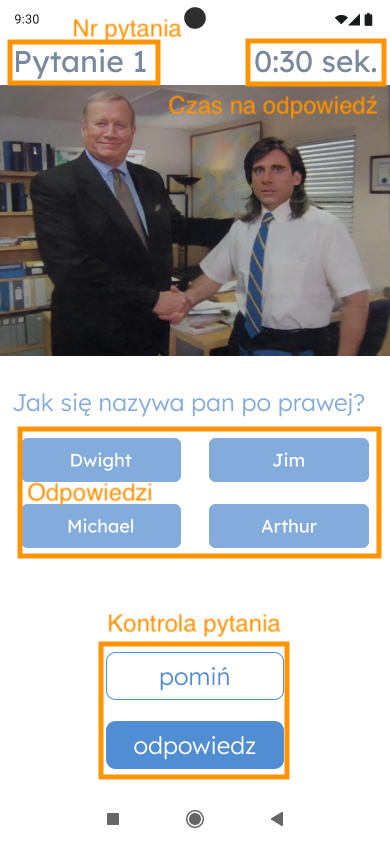
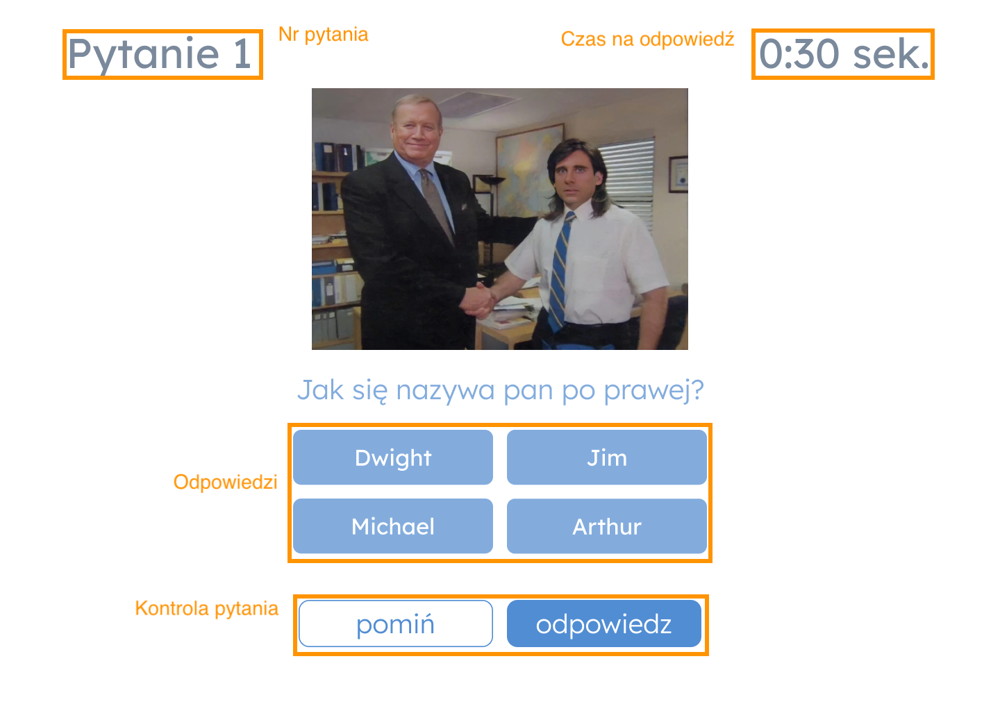
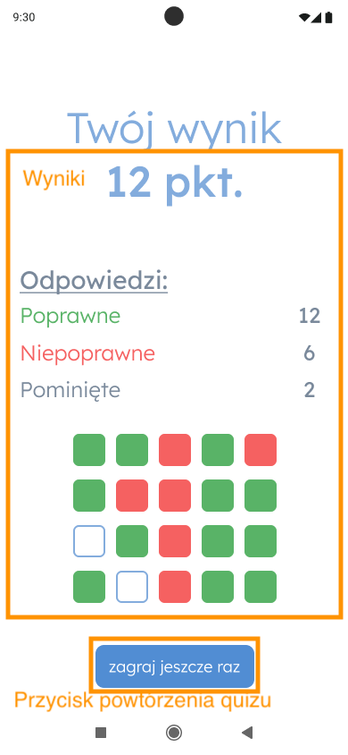
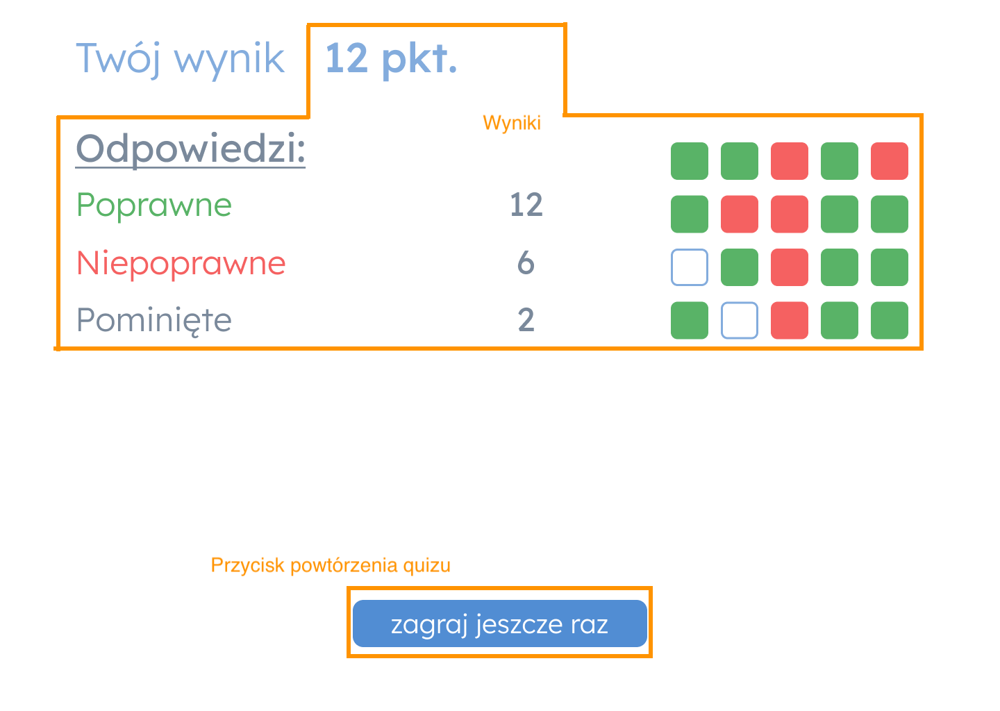
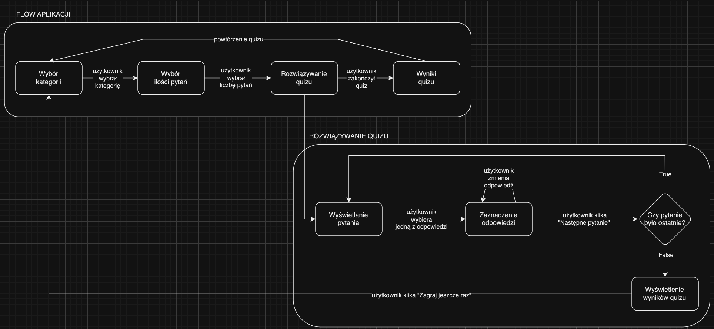

# Quiz

## Wymagania

- `npm: 9.8.1`
- `node: v18.18.2`

## Dostępne skrypty

`npm run dev`

Uruchamia aplikację w trybie deweloperskim.
Otwórz http://localhost:5173/ aby zobaczyć aplikację w przeglądarce.

## Mockupy

https://www.figma.com/file/JQEoV16kpLYvM7LaBbraol/Quiz?node-id=23%3A137&mode=dev

## Specyfikacja

## Źródła danych potrzebne do zaimplementowania aplikacji

Do zaimplementowania funkcjonalności aplikacji będą potrzebne następujące API:

- [Open Trivia DB](https://opentdb.com/) - baza danych pytań z różnych kategorii
- [Pexels API](https://www.pexels.com/api/documentation/) - zdjęcia do quizu

Dodatkowo: w razie problemów z dostępem do API, mamy gotowe repozytorium gotowych pytań. W razie problemów poinformuj prowadzących.

## Ekran wyboru kategorii

### Elementy strony

#### Lista kategorii
 - zestaw przycisków z nazwami kategorii
 - kliknięcie kategorii powinno ją "zaznaczyć"

#### Przycisk start
 - powinien był wyłączony gdy nie jest wybrana żadna kategoria
 - po kliknięciu aplikacja powinna przejść do wyboru trybu

### Widoki

#### Urządzenia mobilne:

#### Urządzenia desktopowe

## Ekran wyboru trybu

### Elementy strony

#### Przyciski wyboru trybu
 - zestaw przycisków z ilością pytań
 - kliknięcie trybu powinno go "zaznaczyć"

#### Przycisk start
 - powinien był wyłączony gdy nie jest wybrany żaden tryb
 - po kliknięciu aplikacja powinna rozpocząć quiz

### Widoki

#### Urządzenia mobilne:

#### Urządzenia desktopowe

## Ekran pytania

### Elementy strony

#### Nr pytania
 - wyświetla aktualny numer pytania

#### Czas na odpowiedź
  - domyślnie 30 sekund
  - powinien rozpocząć odliczanie zaraz po załadowaniu pytania
  - po upływie czasu pytanie jest pomijane a quiz przechodzi do następnego lub ekranu wyników

#### Odpowiedzi
 - zestaw przycisków z odpowiedziami
 - kliknięcie odpowiedzi powinno ją "zaznaczyć"

#### Kontrola pytania
 - przycisk "pomiń" powinien przejść do następnego pytania
 - przycisk "odpowiedz" powinien być wyłączony do momentu wybrania odpowiedzi
 - przycisk "odpowiedz" powinien zmienić nazwę na "zakończ quiz" kiedy wyświelane jest ostatnie pytanie

### Widoki

#### Urządzenia mobilne:

#### Urządzenia desktopowe

## Ekran wyników

### Elementy strony

#### Wyniki
 - powinny wyświetlić nagłówek z ilością poprawnych odpowiedzi
 - powinny wyświetlić dokładną liczbę poprawnych, niepoprawnych oraz pominiętych odpowiedzi
 - powinny wyświetlić siatkę wizualizującą odpowiedzi na pytania

#### Przycisk powtórzenia quizu
 - powinien przekierować do ekranu wyboru kategorii

### Widoki

#### Urządzenia mobilne:

#### Urządzenia desktopowe

## Flow aplikacji
